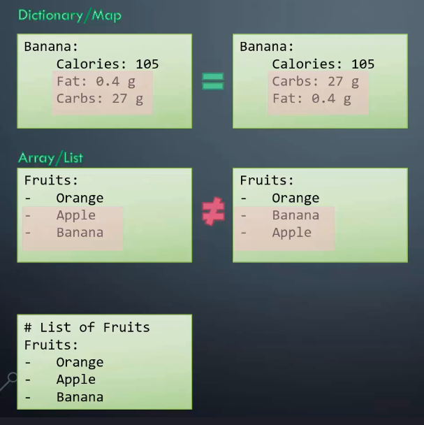
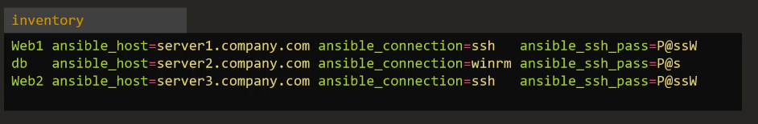
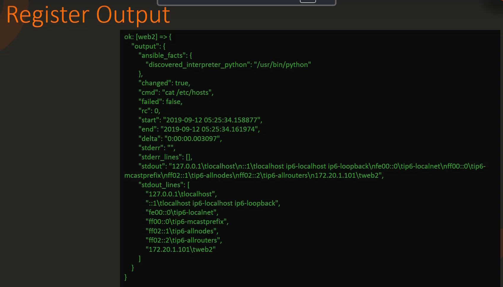
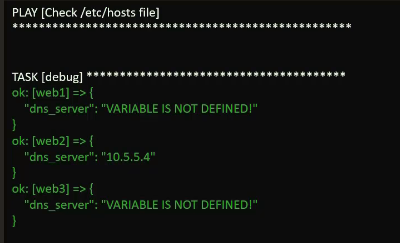
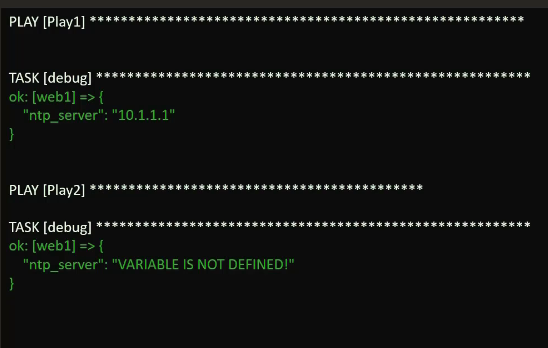
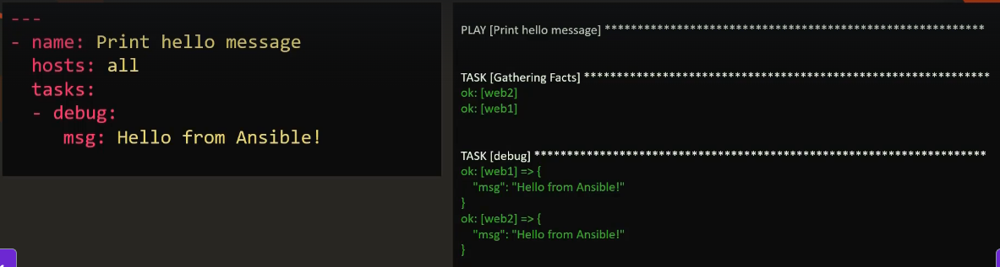
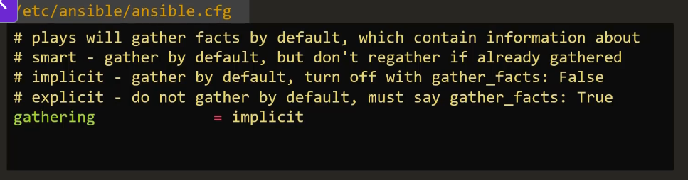
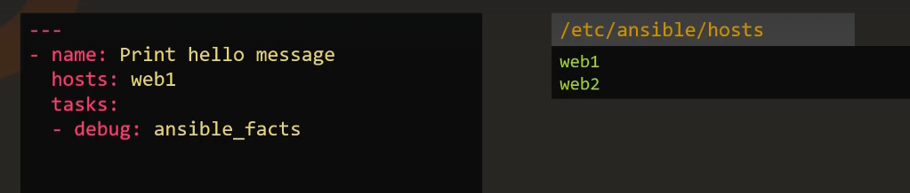

# Ansible

## Installation

```bash
sudo yum install ansible -y  # for CentOs
```

## Ansible configuration files

When ansible is installed, then the default config file will be created:

```bash
/etc/ansible/ansible.cfg  # default config
```

Config file is divided into sections, each section has key-value pairs.

If we have special requirements for different playbooks, we have 2 ways:

1. Copy the default config file to the desired playbooks:

    ```bash
    /etc/ansible/ansible.cfg            # default config
    /opt/web-playbooks/ansible.cfg      # config for web playbooks
    /opt/db-playbooks/ansible.cfg       # config for db playbooks
    /opt/network-playbooks/ansible.cfg  # config for network playbooks
    ```

2. If we want to store the config files in our location, then update the env variable!

    ```bash
    # our dir with the config
    /opt/ansible-web.cfg
    # update the env variable
    $ANSIBLE_CONFIG=/opt/ansible-web.cfg ansible-playbook playbook.yml
    ```

---

### Priority of the config files

If you have many configs - then this priority of the configs will be applied:  

1. Env variable (will overwrite others): `$ANSIBLE_CONFIG=/opt/ansible-web.cfg`
2. Config in playbook dir: `/opt/web-playbooks/ansible.cfg`
3. Config in user's home dir: `.ansible.cfg`
4. The default config: `/etc/ansible/ansible.cfg`

> **Note:** Don't specify ALL the parameters in your config, specify only the ones you want to overwrite from default config for example.

If we need to change only ONE parameter, we can change it with environment variables:

```bash
/etc/ansible/ansible.cfg  # default config
gathering = implicit      # we want to set it to explicit

# IMPORTANT: ansible variables can be transformed to environment variables like this
#    ANSIBLE_ + Uppercase name of the variable, so gathering -> ANSIBLE_GATHERING
ANSIBLE_GATHERING=explicit

# 1. for one-time execution
$ANSIBLE_GATHERING=explicit ansible-playbook playbook.yml  # applicable for only single playbook execution

# 2. for shell-session bound execution
export ANSIBLE_GATHERING=explicit
ansible-playbook playbook.yml

# 3. for persistent approach, copy the config file to the playbook dir
/opt/web-playbooks/ansible.cfg
gathering = explicit  
```

---

### How to view configuration files

```bash
ansible-config list  # list all configurations
ansible-config view  # shows the current active config file
ansible-config dump  # shows the current comprehensive settings
```

Example of the output:

```bash
$ export ANSIBLE_GATHERING=explicit
$ ansible-config dump | grep GATHERING
# Output
#    DEFAULT_GATHERING(env: ANSIBLE_GATHERING) = explicit
```

---

### YAML

All ansible playbooks are written in YAML.

#### Key-Value pairs

```yaml
Fruit: Apple
Vegetable: Carrot
Liquid: Water
Meat: Chicken
```

> NOTE: Must be a colon then a space.

#### Array or List

```yaml
Fruits:
- Orange
- Apple
- Banana
Vegetables:
- Carrot
- Cauliflower
- Tomato
```

> NOTE: Dash indicates that this is an element of the array.

#### Dictionary or Map

```yaml
Banana:
    Calories: 105
    Fat: 0.4 g
    Carbs: 27 g

Grapes:
    Calories: 62
    Fat: 0.3 g
    Carbs: 16 g
```

> NOTE: You should have the same indents for all the elements in a dictionary (map)

Example of Key-Value that contains Dictionary that contains List

```yaml
Fruits:
- Banana:
    Calories: 105
    Fat: 0.4 g
    Carbs: 27 g
- Grapes:
    Calories: 62
    Fat: 0.3 g
    Carbs: 16 g
```

> Note: Dictionaries - UNordered, List - ordered.
> NOTE: Comments are lines that start with #.



--

## Ansible inventory

Ansible can work with multiple systems at the same time. In order to do that, Ansible needs to establish connectivity to those servers by:

- SSH - for Linux
- Powershell Remoting - for Windows

Ansible is `agentless`.

> NOTE: `Agentless` means you don't need to install anything on the target servers, to make Ansible work there, only SSH connection is required.

Default location of the inventory file:

```bash
# inventory file default location
/etc/ansible/hosts/
```

The inventory file is an INI file format:

```ini
server1.company.com
server2.company.com

[mail]
server3.company.com
server4.company.

[db]
server5.company.com
server6.company.com

[web]
server7.company.com
server8.company.com
```

> NOTE: `[mail]` is a group and the values below are the servers of the group

Making aliases for servers:

```ini
# Sample Inventory File

# Web Servers
web1 ansible_host=server1.company.com ansible_connection=ssh ansible_user=root ansible_ssh_pass=Password123!
web2 ansible_host=server2.company.com ansible_connection=ssh ansible_user=root ansible_ssh_pass=Password123!
web3 ansible_host=server3.company.com ansible_connection=ssh ansible_user=root ansible_ssh_pass=Password123!

# Database Servers
db1 ansible_host=server4.company.com ansible_connection=winrm ansible_user=administrator ansible_password=Password123!


[web_servers]
web1
web2
web3

[db_servers]
db1

localhost ansible_host=localhost
```

> NOTE: `ansible_host` parameter is an inventory parameter used to specify FQDN or IP address of a server.

Inventory parameters:

- `ansible_connection` - ssh or winrm or localhost | How ansible connects to a server
- `ansible_port` - 22 for SSH or 5986 for WINRM
- `ansible_user` - root or administrator
- `ansible_ssh_pass` - Password

> NOTE: use SSH key based on password-less authentication between servers for PROD. Don't pass password with `ansible_ssh_pass`.
--

## Inventory formats

Ansible support 2 format types for `inventory file`:

- `INI`
- `YAML`

Simple `INI` file - `inventory file` is enough for a small company / startup.  
`YAML` files are needed for big corporation. This format allows to group server by `roles`, `geographic location` and anything else.

Example of `YAML`:

```yaml
all:
    children:
        webservers:
            hosts:
                web1.example.com:
                web2.example.com:
        dbservers:
            hosts:
                db1.example.com:
                db2.example.com:
```

---

### Grouping and parent-child relationships

Grouping example in `INI`:

```ini
[webservers:children]
webservers_us
webservers_eu

[webservers_us]
server1_us.com ansible_host=192.168.8.101
server2_us.com ansible_host=192.168.8.102

[webservers_eu]
server1_eu.com ansible_host=10.12.0.101
server2_eu.com ansible_host=10.12.0.102
```

Grouping example in `YAML`:

```yaml
all:
    children:
        webservers:
            children:
                webservers_us:
                    hosts:
                        server1_us.com:
                            ansible_host: 192.168.8.101
                        server2_us.com:
                            ansible_host: 192.168.8.102
                webservers_eu:
                    hosts:
                        server1_eu.com:
                            ansible_host: 10.12.0.101
                        server2_eu.com:
                            ansible_host: 10.12.0.102
```

This two inventory files are identical in terms of data.

---

### Ansible variables

Variable can store information that varies with each host.

Example of variables in `inventory file`:  


We can also define variable INSIDE the playbook:

```yaml
# Playbook.yml
name: Add DNS server to resolv.conf
hosts: localhost
vars:
    dns_server: 10.1.250.10
tasks:
    -lineinfile:
        path: /etc/resolv/conf
        line: 'nameserver 10.1.250.10'
```

We can have variables in a separate file:

```yaml
# variables.yml
variable1: value1
variable2: value2
```

Example of using variables in a playbook #1:

```yaml
# Playbook.yml
name: Add DNS server to resolv.conf
hosts: localhost
vars:
    dns_server: 10.1.250.10
tasks:
- lineinfile:
    path: /etc/resolv/conf
    line: 'nameserver {{ dns_server }}'
```

> NOTE: to use variables. Declare them under `vars`. Then use double curly braces and but it like this `{{ dns_server }}`.

Example of using variables in a playbook #2:

```yaml
# Playbook.yml
name: Set Firewall Configurations
hosts: web
vars:
    dns_server: 10.1.250.10
tasks:
- firewalld:
    service: https
    permanent: true
    state: enabled

- firewalld:
    service: 8081/tcp
    permanent: true
    state: disabled
    
- firewalld:
    service: 161-162/udp
    permanent: true
    state: disabled

- firewalld:
    service: 192.0.2.0/24
    permanent: internal
    state: enabled

# we should use Inventory file for storing this variables so it will be 
name: Set Firewall Configurations
hosts: web
vars:
    dns_server: 10.1.250.10
tasks:
- firewalld:
    service: https
    permanent: true
    state: enabled

- firewalld:
    service: '{{ http_port }}'/tcp
    permanent: true
    state: disabled
    
- firewalld:
    service: '{{ snmp_port }}'/udp
    permanent: true
    state: disabled

- firewalld:
    service: '{{ inter_ip_range }}'/24
    permanent: internal
    state: enabled

#Sample inventory file ini:
Web http_port=8081 snmp_port=161-162 inter_ip_range=192.0.2.0

# Or even better create variable-file - web.yml
http_port: 8081
snmp_port: 161-162
inter_ip_range: 192.0.2.0
```

The format of variables with `{{ }}` is called Jinja2 Templating.

Rule of assigning variables with Jinja2 in YAML:

```yaml
source: {{ inter_ip_range }}   # incorrect
source: '{{ inter_ip_range }}' # correct
source: someThing{{ inter_ip_range }}here # correct
```

---

### Ansible variable types

Types:

- strings
- numbers (int and float)
- boolean
- list (ordered)
- dictionary

Boolean values:

| Boolean TRUE value | Boolean FALSE value |
| ------------------ | ------------------- |
| True               | False               |
| 'true'             | 'false'             |
| 't'                | 'f'                 |
| 'yes'              | 'no'                |
| 'y'                | 'n'                 |
| 'on'               | 'off'               |
| '1'                | '0'                 |
| 1                  |  0                  |
| 1.0                |  0.0                |

```yaml
username: "admin"     # string
max_connections: 100  # number
debug_mode: true      # boolean
packages:             # list or array
    - nginx
    - postgresql
    - git
second_package: "{{ packages[1] }}" # usage of list/array
user:                 # dictionary
    name: "admin"
    password: "secret"
message: "Username: {{ user.name }} Password: {{ user.password }}" # usage of dictionary
```

---

### Registering variables and variable precedence

In ansible there are different levels of defining variables:

- GROUP level
- HOST level
- PlAY level
- EXTRA-VAR level

Example: if we have an INI inventory file with different host variables and one `dns_server` variable that is equal for all of them, but one server has it's own dns_server. This var will overwrite the group level var:

```ini
/etc/ansible/hosts
# hosts
web1 ansible_host=172.20.1.100
web2 ansible_host=172.20.1.101 dns_server=10.5.5.4
web3 ansible_host=172.20.1.102

# groups
[web_servers]
web1
web2
web3

[web_servers:vars]
dns_server=10.5.5.3
```

For `web2` dns_server will be used from HOST level: `dns_server=10.5.5.4`

Defining a `dns_server` in playbook, so it's PLAY level and will overwrite GROUP and HOST levels:

```yaml
---
- name: Configure DNS Server
  hosts: all
  vars:
    dns_server: 10.5.5.5
  tasks:
  - nsupdate:
    server: '{{ dns_server }}'
```

Extra-var usage - the HIGHEST precedence:

```bash
ansible-playbook playbook.yml --extra-vars "dns-server=10.5.5.6"
```

---

### How to print the output of the TASK

```yaml
---
- name: Check /etc/hosts file
  hosts: all
  tasks:
  - shell: cat /etc/hosts
    register: result  # the output will be captured here

  - debug:
      var: result.stdout  # will print stdout of the result obj

- name: Play 2
  hosts: all
  tasks:
  - debug:
      var: result.rc

```

The result of SHELL command looks like this:


Or else we can use `-v` option:

```bash
ansible-playbook -i inventory playbook.yml -v
```

And the playbook looks like this:

```yaml
---
- name: Check /etc/hosts file
  hosts: all
  tasks:
  - shell: cat /etc/hosts
```

Will print the WHOLE result SHELL object.  

---

### Variable scope

Scopes:

- Host scope
- Play scope
- Global scope

In this example, we have declared host var `dns_server` for `web2` at `/etc/ansible/hosts`:

```ini
web1 ansible_host=172.20.1.100
web2 ansible_host=172.20.1.101 dns_server=10.5.5.4
web3 ansible_host=172.20.1.102
```

```yaml
---
- name: Print dns server
  hosts: all
  tasks:
  - debug:
      msg: '{{ dns_server }}' 
...
```

So the variable will be printed only for `web2`, because it's scope is a host:  


Another example:

```yaml
---
- name: Play 1
  hosts: web1
  vars:
    ntp_server: 10.1.1.1  # scope is only within the 1st play
  tasks:
  - debug:
      var: ntp_server

- name: Play 2
  hosts: web1
  tasks:
  - debug:
      var: ntp_server
...
```

It will fail for the second one:  


Global scope:

```bash
ansible-playbook playbook.yml --extra-vars "dns_server=10.1.1.1"
```


---

### Magic variables - hostvars

By default `host variables` are not accessible for other hosts. If want to access them, use `magic variables`:

```yaml
---
- name: Print dns server
  hosts: all
  tasks:
  - debug:
        msg: '{{ hostvars['web2'].dns_server }}'
        # or
        msg: '{{ hostvars['web2'].ansible_host }}'
        # or
        msg: '{{ hostvars['web2'].ansible_facts.architecture }}'
        # or
        msg: '{{ hostvars['web2'].ansible_facts.devices }}'
        # or
        msg: '{{ hostvars['web2'].ansible_facts.mounts }}'
        # or
        msg: '{{ hostvars['web2'].ansible_facts.processor }}'
...
```

> NOTE: `msg: '{{ hostvars['web2'].ansible_facts.processor }}'` is equal to `msg: '{{ hostvars['web2']['ansible_facts']['processor'] }}'` You will get the same result.  
---

### Magic variables - groups

Groups can return all the hosts under a given group:

```ini
/etc/ansible/hosts
web1 ansible_host=172.20.1.100
web2 ansible_host=172.20.1.101
web3 ansible_host=172.20.1.102

[web_servers]
web1
web2
web3

[americas]
web1
web2

[asia]
web3
```

Then if you have this in your playbook, you can get:

```yaml
msg: '{{ groups['americas'] }}'
# Output:
# web1
# web2
```

---

### Magic variables - group_names

`group_names` returns all the groups the current host is part of

```ini
/etc/ansible/hosts
web1 ansible_host=172.20.1.100
web2 ansible_host=172.20.1.101
web3 ansible_host=172.20.1.102

[web_servers]
web1
web2
web3

[americas]
web1
web2

[asia]
web3
```

Then if you have this in your playbook, you can get:

```yaml
msg: '{{ group_names }}' # in web1 playbook
# Output:
# web_servers
# americas
```

---

### Magic variables - inventory_hostname

`inventory_hostname` gives the name configured for the host in `inventory file`, not the host name or SQDN.

There are more `magic variables`, read about them here: [official page](https://docs.ansible.com/ansible/latest/playbook_guide/playbooks_vars_facts.html)

---

### Ansible facts

When Ansible connects to a machine, firstly it collects
Information about the machine:

- basic system information
- system architecture
- OS version
- processor details
- memory details
- serial numbers
- ...
- host's network connectivity
- different interfaces
- ip addresses
- FQDN
- MAC address,
- ...
Those are called `facts`.
It's done using `Setup` module and it's run automatically even if you didn't use it.  

  

All data is store in variable `ansible_facts`:

```yaml
---
- name: Print hello message
  hosts: all
  tasks:
  - debug:
        var: ansible_facts
...
```

These details could come in handy within your playbooks. For example, when configuring devices and logical volumes on your nodes.

If we don't want to gather facts, we can disable it:

```yaml
---
- name: Print hello message
  hosts: all
  gather_facts: False  # disabling
  tasks:
  - debug:
        var: ansible_facts
...
```

The behavior is set in Ansible configuration file called Gathering:  
  

If you specified some host in a playbook, then ansible facts will be collected only for them:



## Ansible playbooks

`Playbook` is a `yaml` file and contains of `plays`.
`Play` defines a set of activities to be run on one `host` or a `group of hosts`.
A `task` is a single action to be performed on a `host`.  

Tasks:

- Execute a command
- Install a package
- Shutdown or restart host

Example of an playbook.yaml:

```yaml
---
- name: Play 1
  hosts: localhost
  tasks:
  - name: Execute command 'date'
    command: date

  - name: Execute script on a server
    script: test_script.sh

  - name: Install httpd service
    yum:  # CentOS apt-install analog
      name: httpd
      state: present

  - name: Start web server
    service:
      name: httpd
      state: started
...
```

Playbook format:

```yaml
---
# Playbook is a list of dictionaries

# dict 1
-   name: Play 1 
    hosts: localhost # should be defined in inventory file
    tasks: # list / array of items
        # list[0]
        - name: Execute command 'date'
        command: date # module

        # list[1]
        - name: Execute script on a server
        script: test_script.sh # module 


# dict 2 
-   name: Play 2
    hosts: localhost
    tasks:  # list / array of items
        # list[0]
        - name: Install httpd service 
          yum:  # module | yum is CentOS apt-install analog 
            name: httpd
            state: present

        # list[1]
        - name: Start web server
          service: # module
            name: httpd
            state: started
...
```

How to run an ansible playbook:

```shell
ansible-playbook playbook.yml
ansible-playbook --help
```

---

### Verifying ansible playbooks

Ansible provides several modes for verifying playbooks without any actual changes on the hosts:

- Check mode `--check` a.k.a. dry run, don't save changes
- Diff mode `--diff` shows before-and-after state
- Syntax check `--syntax-check`, just checks syntax, not running

Example:

```shell
ansible-playbook update_service.yml --check
ansible-playbook configure_database.yml --check --diff
```

> NOTE: not all the modules support `check mode`.

There is also `ansible-lint` to check ansible playbooks style:

```shell
ansible-lint playbook.yml
```

---

### Conditionals

Conditions are used to run tasks only when they satisfy the given condition.  

> NOTE: The keyword for using a condition is `when`.  

Example for checking OS to use a proper package manager:

```yaml
---
- name: Install NGINX
  hosts: all
  tasks:
  - name: Install nginx on Debian
    apt:
        name: nginx
        state: present
    when: ansible_os_family == "Debian" and
          ansible_distribution_version == "16.04"
          

  - name: Install nginx on RedHat
    yum:
        name: nginx
        state: present
    when: ansible_os_family == "RedHat" or
          ansible_os_family == "SUSE"
...
```

Example for using `loops`:

> NOTE: The keyword for using a loop is `loop`.

```yaml
---
- name: Install software
  hosts: all
  vars:
    packages:
        - name: nginx
          required: True
        - name: mysql
          required: True
        - name: apache
          required: False
  tasks:
  - name: Install '{{ item.name }}' on Debian
    apt:
        name: '{{ item.name }}'
        state: present
    loop: '{{ packages }}'
    when: item.required == True
...
```

Example of using the previous result in a condition:

```yaml
---
- name: Check status of a service and email if its down
  hosts: localhost
  tasks:
    - command: service httpd status
      register: result

    - mail:
        to: admin@company.com
        subject: Service alert
        body: Httpd service is down
        when: result.stdout.find('down') != -1
...
```

Specific example - "Install a specific version of ngnix only on your Ubuntu server 18.04":

```yaml
---
- name: Install ngnix on Ubuntu 18.04
  apt:
    name: ngnix=1.18.0
    state: present
  when: ansible_facts['os_family'] == 'Debian' and # ansible facts!
        ansible_facts['distribution_major_version'] == '18'
...
```

Specific example - "You app has different requirements for different environments, such as production, test and etc.":

```yaml
---
- name: Deploy configuration files
  template:
    src: '{{ app_env }}_config.j2'
    dest: '/etc/myapp/config.conf'
  vars:
    app_env: production
...
```

Specific example - "Perform tasks on all servers, but start the web app  service only on the servers in the production environment.":

```yaml
---
- name: Install required packages
  apt:
    name: 
     - package1
     - package2
    state: present

- name: Create necessary directories and set permissions

- name: Start web application service
  service:
    name: myapp
    state: started
  when: environment == 'production'
...
```

---

### Loops

`loop` is a new syntax in ansible.  

Example of creating many users with `loop`:

```yaml
---
- name: Create users
  hosts: localhost
  tasks:
    - user: name='{{ item }}' state=present
      loop:
      - joe
      - mike
      - ...
...
```

---
Example of creating many users with IDs with `loop`:

```yaml
---
- name: Create users
  hosts: localhost
  tasks:
    - user: name='{{ item.name }}' state=present uid='{{ item.uid }}'
      loop:
      - { name: joe, uid: 1010 }
      - { name: mike, uid: 1011 }
      - ...
...
```

---

### Loops with_*

`with_items` is an old syntax in ansible.  

Those are special modules for different collections, like files, dbs and etc...

```yaml
---
- name: Create users
  hosts: localhost
  tasks:
    - user: name='{{ item }}' state=present
      loop:
      - joe
      - mike
      - ...

# Is the same
- name: Create users
  hosts: localhost
  tasks:
    - user: name='{{ item }}' state=present
      with_items:
      - joe
      - mike
      - ...

...
```

---

### Ansible modules

There different modules in ansible:

- system (os level)
  - user
  - group
  - hostname
  - ping
  - service
  - iptables
  - lvg
  - lvol
  - make
  - mount
  - timezone
  - systemd
  - ...
- commands (execute commands or scripts)
  - command
  - script
  - shell
  - expect  (interactive exec, prompts)
  - raw
- file
  - acl
  - archive
  - copy
  - file
  - find
  - lineinfile
  - replace
  - stat
  - template
  - unarchive
- database
  - mongodb
  - mssql
  - mysql
  - postgresql
  - proxysql
  - vertica
- cloud
  - amazon
  - docker
  - azure
  - ...
- windows
- ...

#### Module - command

Executes a command on a remote node.  

> NOTE: `ansible.builtin.command` == `command`

<https://docs.ansible.com/ansible/latest/collections/ansible/builtin/command_module.html>

Example of usage:

```yaml
---
- name: Play 1
  hosts: localhost
  tasks:
    - name: Execute command 'date'
      command: date

    - name: Display resolv.conf contents
      command: cat /etc/resolv.conf

    # 'chdir' is used to go /etc FIRST and then cat resolv.conf will be done
    - name: Display resolv.conf contents with cd first
      command: cat resolv.conf chdir=/etc

    # 'creates' is used to check the dir doesn't exist, otherwise skip the step
    - name: Create /folder
      command: mkdir /folder creates=/folder

    # command module is a FREE FORM, so it can be used in 2 ways
    # way 1
    - name: Run command if /path/to/database does not exist (without 'args')
      ansible.builtin.command: /usr/bin/make_database.sh db_user db_name creates=/path/to/database

    # way 2
    - name: Run command if /path/to/database does not exist (with 'args' keyword)
      ansible.builtin.command: /usr/bin/make_database.sh db_user db_name
      args:
        creates: /path/to/database
    
    # however copy module is NOT A FREE FORM, strict syntax like that!
    - name: Copy file from source to destination
      copy: src=/source_file dest=/destination
...
```

#### Module - script

Runs a local script on a remote node after transferring it.

Example of usage:

```yaml
---
- name: Play 1
  hosts: localhost
  tasks:
    - name: Run a script on remote server
      script: /some/local/myscript.sh -arg1 -arg2
...
```

#### Module - service

Manages services like - start, stop, restart

Example of usage:

```yaml
---
- name: Start Services in order
  hosts: localhost
  tasks:
    # service module is NOT A FREE FORM
    - name: Start the database service
      service: name=postgresql state=started 
    
    - name: Start the httpd service
      service: name=httpd state=started
    
    # OR
    - name: Start the nginx service
      service:
        name: nginx
        state: started

    - name: Start the database service
      service:
        name: postgresql
        state: started
...
```

#### Module - lineinfile

Search for a line in a file and replace it or add it if it doesn't exist.

Example of usage:

```ini
/etc/resolv.conf
nameserver 10.1.250.1
nameserver 10.1.250.2
```

```yaml
---
- name: Add DNS server to resolv.conf
  hosts: localhost
  tasks:
    - name: Run lineinfile
      # idempotency
      lineinfile:
        path: /etc/resolv.conf
        line: 'nameserver 10.1.250.10'
...
```

## Ansible plugins

Ansible Plugin - is a piece of code that extends or modifies Ansible functionality (extra or custom behavior).
Plugin types:

- Inventory plugin
- Module plugin
- Action plugin
- Callback plugin

Examples:

- `Dynamic Inventory plugin` fetch real-time information about your cloud resources directly from your API.
- `Module plugin` integrates your cloud provider API.
- `Action plugin` simplifies management of load balancing rules, SSL certificates, Health Checks.
- `Lookup plugin` fetch data from external resources like DB or API and use this data inside the playbooks.
- `Filter plugin` data manipulation, transformation.
- `Connection plugin` connect and communicate with SSH, WinRM, Docker
- `Inventory plugin` retrieve inventory information from various sources, like Cloud providers or DBs.
- `Callback plugin` provide hooks into Ansible's lifecycle, capture events and perform custom actions during playbook execution.

### Module and Plugin index

You can find it here:
<https://docs.ansible.com/ansible/latest/collections/all_plugins.html>

## Ansible handlers

Useful when you need to restart a server after a task.  

With handlers you can define an action to restart the web server service and associate it with the task that modifies the configuration file. It creates a dependency between the task and the handler:

- Task triggered by `events` or `notifications`
- Defined in playbook, executed when notified by a task
- Manage actions based on system state/configuration changes

Example:

```yaml
---
- name: Deploy application
  hosts: application_servers
  tasks:
    - name: Copy application code
      copy:
        src: app_code/
        dest: /opt/application/
      # restart the application when this task completes
      notify: Restart application service
    
  handlers:
    - name: Restart application service
      service:
        name: application_service
        state: restarted
...
```

## Ansible Roles

`Roles` == `Libraries`  
`Roles` for a server means to create a server with a specific settings and installed packages:

- `mysql role`:
  - install pre-requisites
  - instal mysql
  - configure mysql service

- `nginx role`:
  - install pre-requisites
  - instal nginx
  - configure nginx service
  - configure custom web pages

So this is the equivalent to do via `playbook`:

```yaml
---
- name: Install and configure MySQL
  hosts: db-server
  tasks:
    - name: Install pre-requisites
      yum: name=pre-req-packages state=present

    - name: Install MySQL packages
      yum: name=mysql state=present

    - name: Start MySQL service
      service: name=mysql state=started

    - name: Configure database
      mysql_db: name=db1 state=present
...
```

Instead of rewriting this again and again, we can package it into a `role`:

```yaml
# Playbook
- name: Install and configure MySQL
  # assign a role to any amount of servers
  hosts: db-server1...db-server100
  # assign a role
  roles: 
    - mysql

# MySQL-Role
tasks:
  - name: Install pre-requisites
    yum: name=pre-req-packages state=present

  - name: Install MySQL packages
    yum: name=mysql state=present

  - name: Start MySQL service
    service: name=mysql state=started

  - name: Configure database
    mysql_db: name=db1 state=present
...
```

Roles introduce a set of best practices:

- All `tasks` should be in a `task directory`
- All `variables` used by these task should go into `default directory`
- All `handlers` go into the `handlers directory`
- Any `templates` used by playbooks go to the `template directory`

Roles can be shared with other developers via [Ansible-Galaxy](https://galaxy.ansible.com/ui/)

To create a skeleton of a project use `ansible-galaxy` tool:

```shell
# example for a custom role 
ansible-galaxy init mysql

# it creates:
# mysql/:
#   - README.md
#   - templates/
#   - tasks/
#   - handlers/
#   - vars/
#   - defaults/
#   - meta/
```

To assign your custom role to your playbook you choose 2 ways:

1. put role in the common ansible directory (`/etc/ansible/roles`). It's defined in the `/etc/ansible/ansible.cfg` like `roles_path = /etc/ansible/roles`
2. put role folder beside playbook:

```shell
# 2. Put your role beside playbook
# my-playbook:
#   - playbook.yaml
#   - roles/:
#       - mysql/:
#         - README.md
#         - templates/
#         - tasks/
#         - handlers/
#         - vars/
#         - defaults/
#         - meta/
```

Your playbook will look like this:

```yaml
# playbook.yaml
- name: Install and configure MySQL
  hosts: db-server
  roles: 
    - mysql
```

---

### Use 3rd party roles

Search for a role:

- via Ansible-Galaxy UI
- via command line `ansible-galaxy search mysql`

Install with `ansible-galaxy install geerlingguy.mysql`. It will be extracted to the common directory of roles `/etc/ansible/roles`.

Use roles in the playbook:

```yaml
# 1. Simple approach in playbook.yaml
- name: Install and configure MySQL
  hosts: db-server
  roles: 
    - geerlingguy.mysql

# 2. Advanced approach in playbook.yaml 
- name: Install and configure MySQL
  hosts: db-server
  roles: 
    - role: geerlingguy.mysql
      become: yes # to pass additional options like vars
      vars:
        mysql_user_name: db-users
```

To configure a server with both database and web application on it:

```yaml

- name: Install and configure MySQL and Web Server
  hosts: db-server
  roles: 
    - geerlingguy.mysql
    - nginx

```

To configure two different servers - one for database and one for web application:

```yaml

- name: Install and configure MySQL
  hosts: db-server
  roles: 
    - geerlingguy.mysql

- name: Install and configure Web Server
  hosts: db-server
  roles: 
    - nginx
```

To list all installed roles: `ansible-galaxy list`
To check where would role be installed: `ansible-config dump | grep ROLE`. The path will be in `DEFAULT_ROLES_PATH` variable.
To install role in the current directory: `ansible-galaxy install geerlingguy.mysql -p ./roles`

---

## Ansible Collections

For large network infrastructure like:

- CISCO
- Juniper
- Arista

Ansible provides a set of built-in modules for network automation.

Example of Ansible collections:

- network.cisco
- network.juniper
- network.arista

Each collection contains vendor specific modules, roles and playbooks tailored for managing network devices.

Install CISCO collection:  
`ansible-galaxy collection install network.cisco`

This will allow you to seamlessly integrate network automation tasks to CISCO devices into your existing Ansible workflows.

Collection encapsulates these components:

- package
- distribute modules
- roles
- plugins
- etc.

Collections are self-contained, so you can access and share them easily.

Collections can be created by community and vendors.

### Collection benefits

#### Expanded functionality

Here we are using Amazon AWS to extending Ansible native capabilities.

Install the collection:

```bash
ansible-galaxy collection install amazon.aws
```

Use the modules inside the playbook:

```yaml
- hosts: localhost
  collections:
    - amazon.aws
  tasks:
    - name: Create an S3 bucket
      aws_s3_bucket:
        name: my-bucket
        region: us-west-1
```

#### Modularity and Reusability

```text
my_collection/
- docs/
- galaxy.yml
- plugins/modules/my_custom_module.py
- README.md
- roles/my_custom_role/tasks/main.yml
```

Example of creating a custom collection with specific roles, modules and plugins:

```yaml
- hosts: localhost
  collections:
    - my_namespace.my_collection

  roles:
    - my_custom_role

  tasks:
    - name: Use a custom module
      my_custom_module:
        param: value
```

#### Simplified distribution and management

Example of versioning and dependency management. This is `requirement.yml`:

```yaml
collections:
  - name: amazon.aws
    version: "1.5.0"
  - name: community.mysql
    src: https://github.com/ansible-collections/community.mysql
    version: "1.2.1"
```

You can specify the required collections and their versions in a `requirement.yml` file. To use it, run:

```bash
ansible-galaxy collection install -r requirements.yml
```

## Templating

You have a syntax of `{{ variable }}` so the value of `variable` will be replaced with actual value in the runtime.

### Playbook template example

```yaml
# Template
- hosts: web1
  tasks:
    - file:
        path: {{ file }}
        state: touch 

# Variables
file: /tmp/1.txt

# Outcome
- hosts: web1
  tasks:
    - file:
        path: /tmp/1.txt
        state: touch 
```

### Configuration template example

```ini
# Template
[mysqld]
innodb-buffer-pool-size={{ pool_size }}
datadir={{ datadir }}
user={{ mysql_user }}
symbolic-links={{ link_id }}
port={{ mysql_port }}

# Variables
pool_size: 5242880
datadir: /var/lib/mysql
mysql_user: mysql
link_id: 0
mysql_port: 3306

# Outcome
[mysqld]
innodb-buffer-pool-size=5242880
datadir=var/lib/mysql
user=mysql
symbolic-links=0
port=3306
```

### Jinja2 templates

`Jinja2` it a `python` template engine.

#### String manipulation and filters

```python
# Simple substitution
my_name = "Bond"
message = "The name is {{ my_name }}"
# Result:
# "The name is Bond"

# Substitution and upper case filter
my_name = "Bond"
message = "The name is {{ my_name | upper }}"
# Result:
# "The name is BOND"

# Substitution and lower case filter
my_name = "Bond"
message = "The name is {{ my_name | lower }}"
# Result:
# "The name is bond"

# Substitution and title filter
my_name = "bond" # note, the name is in lower case
message = "The name is {{ my_name | title }}"
# Result:
# "The name is Bond"

# Substitution and replace filter
my_name = "Bond"
message = "The name is {{ my_name | replace('Bond', 'Bourne') }}"
# Result:
# "The name is Bourne"

# Substitution and default filter
my_name = "Bond"
# note: first_name is not declared
#   template will fail if try to use it without default filter
message = "The name is {{ first_name | default('James') }} {{ my_name }}"
# Result:
# "The name is James Bond"
```

#### Filters - List and set

```python
# Get the min number
{{ [1, 2, 3] | min }}
# Result:
# 1

# Get the max number
{{ [1, 2, 3] | min }}
# Result:
# 3


# Get the unique numbers
{{ [1, 2, 3, 2, 3] | unique }}
# Result:
# [1, 2, 3]

# Merge or union two lists, will result in a merged list with unique values 
{{ [1, 2, 3, 4] | union([4, 5]) }}
# Result:
# [1, 2, 3, 4, 5]

# Get the common numbers in two arrays 
{{ [1, 2, 3, 4] | intersect([4, 5]) }}
# Result:
# 4

# Get a random number
{{ 100 | random }}
# Result:
# A random integer between 1 to 100

# Join list of values into a string
{{ ["The", "name", "is", "Bond"] | join(" ") }}
# Result:
# "The name is Bond"
```

#### FOR loop

```python
# Print numbers from 0 to 4

{{ number }}

# Result:
# 0
# 1
# 2
# 3
# 4
```

#### Conditions

```python
# Print even numbers from 0 to 4

  
    {{ number }}
  

# Result:
# 0
# 2
# 4
```

### Ansible template filters

```python
# Get basename in Linux
{{ "etc/host" | basename }}
# Result:
# "host"

# Get basename in Win
{{ "c:\windows\hosts" | win_basename }}
# Result:
# "host"

# Separate letter from path in Win
{{ "c:\windows\hosts" | win_splitdrive }}
# Result:
# ["c:", "\windows\hosts"]

# Separate letter from path in Win and get the first element of the array
{{ "c:\windows\hosts" | win_splitdrive | first }}
# Result:
# "c:"

# Separate letter from path in Win and get path or the last element of the array
{{ "c:\windows\hosts" | win_splitdrive | last }}
# Result:
# "\windows\hosts"
```

### Jinja2 in Playbooks

```ini
# /etc/ansible/hosts
web1 ansible_host=172.20.1.100 dns_server=10.5.5.4
web2 ansible_host=172.20.1.101 dns_server=10.5.5.4
web3 ansible_host=172.20.1.102 dns_server=10.5.5.4
```

```yaml
- name: Update dns server
  hosts: all
  tasks:
    - nsupdate:
        server: '{{ dns_server }}'
```

Before executing the playbook, Ansible runs the playbook through the Jinja2 templating engine, and the variables from inventory file are gathered, and then we get a new version of the playbook with the replaced variables.

[Ansible filters documentation page.](https://docs.ansible.com/ansible/latest/playbook_guide/playbooks_filters.html)

A specific example with replacing a server name inside index.html for 3 web servers:

inventory file in `/etc/ansible/hosts`:

```ini
[web_servers]
web1 ansible_host=172.20.1.100
web2 ansible_host=172.20.1.101
web3 ansible_host=172.20.1.102
```

playbook.yml:

```yaml
- hosts: web_servers
  # we assume that NGINX is already installed on all web servers
  tasks:
    - name: Copy index.html to remove servers
      template:
        src: index.html.j2
        dest: /var/www/nginx-default/index.html
      
      # if we will use copy module like this:
      # the substitution will not be done, those will be plain copies

      # copy:
      #   src: index.html.j2
      #   dest: /var/www/nginx-default/index.html

```

> NOTE: we should explicitly use `.j2` extension for a file if we want to use Jinja2 templates.

index.html.j2:

```html
<!DOCTYPE html>
<html>
<body>
  This is {{ inventory_hostname }} server
</body>
</html>
```

When we start the playbook, Ansible will create 3 different subprocesses for each host:

- subprocess web1
- subprocess web2
- subprocess web3

Each process creates its own set of parameters for each host by performing `variable interpolation`:

```ini
# subprocess web1
inventory_hostname=web1
ansible_host=172.20.1.100

# subprocess web2
inventory_hostname=web2
ansible_host=172.20.1.101

# subprocess web3
inventory_hostname=web3
ansible_host=172.20.1.102
```

Then it's gathering facts from the host, so now each subprocess has a lot more information.

```ini
# subprocess web1
inventory_hostname=web1
ansible_host=172.20.1.100
ansible_facts=<Host Facts of web1>

# subprocess web2
inventory_hostname=web2
ansible_host=172.20.1.101
ansible_facts=<Host Facts of web2>

# subprocess web3
inventory_hostname=web3
ansible_host=172.20.1.102
ansible_facts=<Host Facts of web3>
```

Then the process starts executing the playbook. Each subprocess executes the template task for the respective host by taking the `index.html.j2` file and performing `variable interpolation` on it. So at the end `index.html` will be generated with the respective values inside.

```html
<!-- subprocess web1 -->
<!DOCTYPE html>
<html>
<body>
  This is web1 server
</body>
</html>

<!-- subprocess web2 -->
<!DOCTYPE html>
<html>
<body>
  This is web2 server
</body>
</html>

<!-- subprocess web3 -->
<!DOCTYPE html>
<html>
<body>
  This is web3 server
</body>
</html>
```

Then the template module will also copy the files.

#### NGINX configuration file example

This is example of `nginx.conf.j2`:

```conf
server {
  location / {
    fastcgi_pass {{host}}:{{port}};
    fastcgi_param QUERY_STRING $query_string;
  }

  location ~ \ gif|jpg|png $ {
    root {{ image_path }};
  }
}
```

This is result `nginx.conf`:

```conf
server {
  location / {
    fastcgi_pass localhost:9000;
    fastcgi_param QUERY_STRING $query_string;
  }

  location ~ \ gif|jpg|png $ {
    root /data/images;
  }
}
```

#### Redis configuration file example

This is example of `redis.conf.j2`:

```conf
bind {{ ip_address }}
protect-mode yes
port {{ redis_port | default('6379') }}
tcp-backlog 511

#Unix socket
timeout 0

# TCP keepalive
tcp-keepalive {{ tcp_keepalive | default('300') }}

daemonize no
supervised no
```

This is result `redis.conf`:

```conf
bind 192.168.1.100
protect-mode yes
port 6379
tcp-backlog 511

#Unix socket
timeout 0

# TCP keepalive
tcp-keepalive 300

daemonize no
supervised no
```

#### Using templates to generate resolv.conf

This is example of `/etc/resolv.conf.j2`:

```conf

nameserver name_server

```

Variables:

```yaml
name_servers:
 - 10.1.1.2
 - 10.1.1.3
 - 8.8.8.8
```

This is result `/etc/resolv.conf`:

```conf
nameserver 10.1.1.2
nameserver 10.1.1.3
nameserver 8.8.8.8
```

#### Templates in Roles

When using templates in roles, create them under the `templates` directory:

```text
mysql/
  README.md
  templates/
    resolv.conf.j2
    redis.conf.j2
  tasks/
  handlers/
  vars/
  defaults/
  meta/
```
