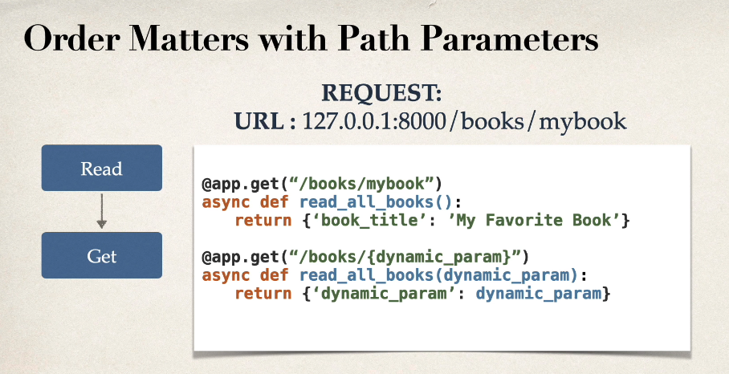

# FastApi

## Installation
You need to download it from the python.org first and install it.

Check that python is installed:
```powershell
# Linux
python3 --version
python3 -m pip --version

# Win
python --version
python -m pip --version
```
___

## Python venv
How to create an venv:
```powershell
# Linux 
python3 -m venv myenv
source myenv/bin/activate
deactivate

# Win
python -m venv myenv
myenv\Scripts\activate.bat
deactivate
```
___

## Pip commands
```powershell
pip list
pip install fastapi
pip install "uvicorn[standard]"
```

## How to start FastApi app
```powershell
python -m uvicorn books:app --reload
```

## Swagger - API Docs
http://127.0.0.1:8000/docs

## GET method
```python
@app.get("/books")
async def read_all_books():
    return BOOKS
```

## GET method with Path Parameters
```python
@app.get("/books/{book_title}")
async def read_book(book_title: str):
    for book in BOOKS:
        if book.get('title').casefold() == book_title.casefold():
            return book
```

## Order matters with Path parameters


## GET method with Query Parameters
```python
@app.get("/books/{book_author}/")
async def read_books_category_by_query(book_author: str, category: str):
    books_to_return = []
    for book in BOOKS:
        if book.get('author').casefold() == book_author and \
           book.get('category').casefold() == category.casefold():
            books_to_return.append(book)
    
    return books_to_return
```

## POST method
```python
@app.post("/books/create_book")
async def create_book(new_book=Body()):
    BOOKS.append(new_book)
```
